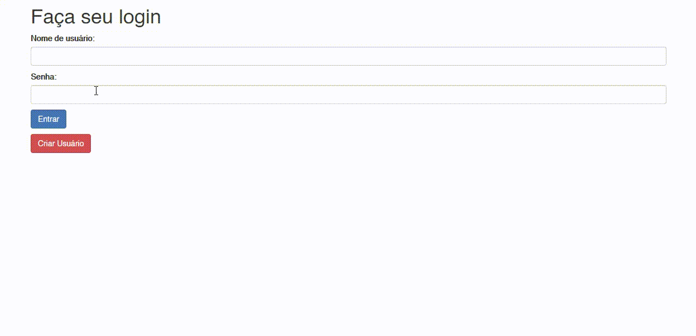

# Flask-Games-Library---With-MySQL

Library insertion and maintenance system.

Possibility of creating multiple users.

Database for each user, MySQL.

Written in Python, using Javascript, Html and Css.

Framework Flask.

Feel free to copy and perfect the code.

Made by Luan Gomes

